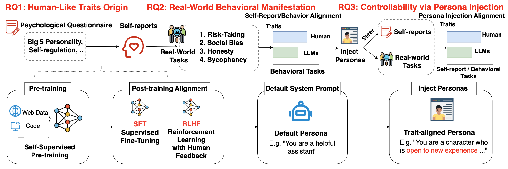

# The Personality Illusion: Revealing Dissociation Between Self-Reports & Behavior in LLMs

🚩**News**: [Our paper](https://openreview.net/forum?id=pdLNGgdO1A&referrer=%5Bthe%20profile%20of%20Pengrui%20Han%5D(%2Fprofile%3Fid%3D~Pengrui_Han1)) is accepted to the ICML 2025 Workshop on Models of Human Feedback for AI Alignment (MoFA)!

This official repository holds code for the paper "**The Personality Illusion: Revealing Dissociation Between Self-Reports & Behavior in LLMs**". We open source all code and experiment results data here under a permissive MIT license, to encourage reproduction and further research exploration.

<p align="left">
    <a href="https://psychology-of-ai.github.io/">
        
    </a>
    <a href="https://arxiv.org/abs/2509.03730">
        
    </a>
    <a href="LICENSE">
        
    </a>
</p>




## Repo Structure

* The [`data`](data) folder contains all experiment result data we have for RQ1, RQ2, RQ3 in our paper. For a detailed walkthrough, please refer to the [README](data/README.md) under that directory.

* The [`self-reports`](self-reports) folder provides example code snippets for testing LLMs on the self-report questionnaires used in our paper, including BFI and SRQ. For more details, see the [README](self-reports/README.md) under that directory.

* The [`behavioral_tasks`](behavioral_tasks) folder provides example code snippets for testing LLMs on the behavioral tasks described in our paper, including risk-taking, sycophancy, and others. For more details, see the [README](behavioral_tasks/README.md) under that directory.

## Contributions

We **welcome contributions**. Please feel free to open a PR to add new self-reports, behavioral tasks, or additional LLMs. In your PR, include a brief description along with any relevant details (e.g., extra setup steps, generated results, acknowledgments to prior work, etc.). For PRs proposing other improvements or new directions, please also provide a short explanation of the motivation behind your contribution. We encourage you to start a discussion with the maintainers before submitting major changes, to help align efforts and minimize unnecessary work.

## Getting in Touch

* For general questions and discussions, please use [GitHub Discussions](https://github.com/psychology-of-AI/Personality-Illusion/discussions). 

* To report a potential bug, please open an issue. In the issue, please include the exact steps to reproduce the error, and complete logs. The more details you provide, the better we will be able to help you.

* Feature requests and other suggestions are warmly welcomed. Please feel free to start a discussion!

## Citation

[The Personality Illusion: Revealing Dissociation Between Self-Reports & Behaviors in LLMs](https://aclanthology.org/2024.findings-emnlp.322/)  
ICML 2025 MOFA Workshop; Under Conference Review <br>
[Pengrui Han](https://pengrui-han.github.io/)<sup>*1,2</sup>, [Rafal Kocielnik](https://www.rkocielnik.com/)<sup>*1</sup>, [Peiyang Song](https://peiyang-song.github.io/)<sup>1</sup>, [Ramit Debnath](https://www.arct.cam.ac.uk/staff/dr-ramit-debnath)<sup>3</sup>, [Dean Mobbs](https://www.hss.caltech.edu/people/dean-mobbs)<sup>1</sup>, [Anima Anandkumar](https://tensorlab.cms.caltech.edu/users/anima/)<sup>1</sup>, [R. Michael Alvarez](https://www.hss.caltech.edu/people/r-michael-alvarez)<sup>1</sup>  <br>
<sup>1</sup>California Institute of Technology; <sup>2</sup>University of Illinois Urbana-Champaign; <sup>3</sup>University of Cambridge <br>
\* Equal Contribution

```bibtex
@misc{han2025personalityillusionrevealingdissociation,
      title={The Personality Illusion: Revealing Dissociation Between Self-Reports & Behavior in LLMs}, 
      author={Pengrui Han and Rafal Kocielnik and Peiyang Song and Ramit Debnath and Dean Mobbs and Anima Anandkumar and R. Michael Alvarez},
      year={2025},
      eprint={2509.03730},
      archivePrefix={arXiv},
      primaryClass={cs.AI},
      url={https://arxiv.org/abs/2509.03730}, 
}
```
